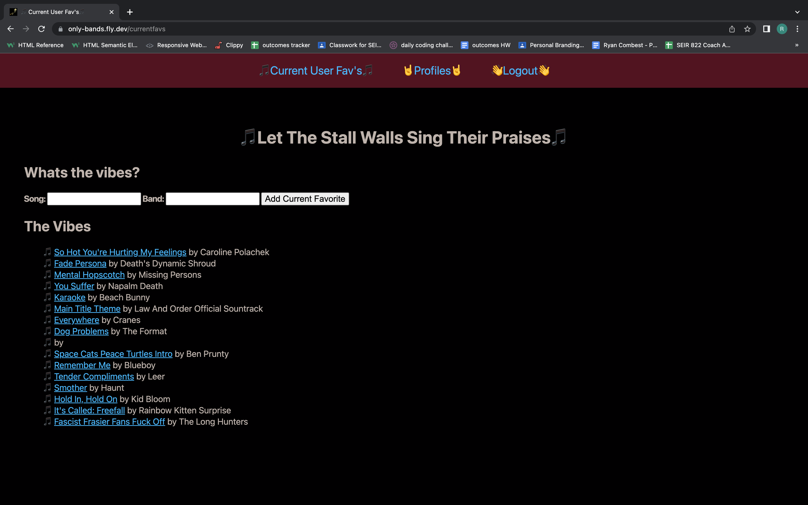
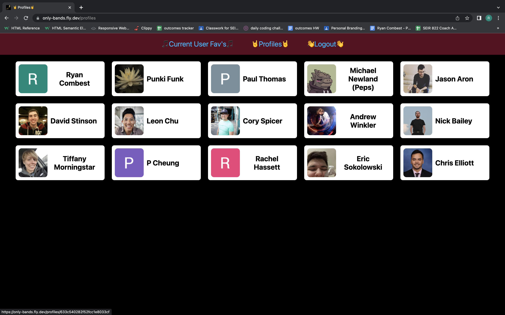
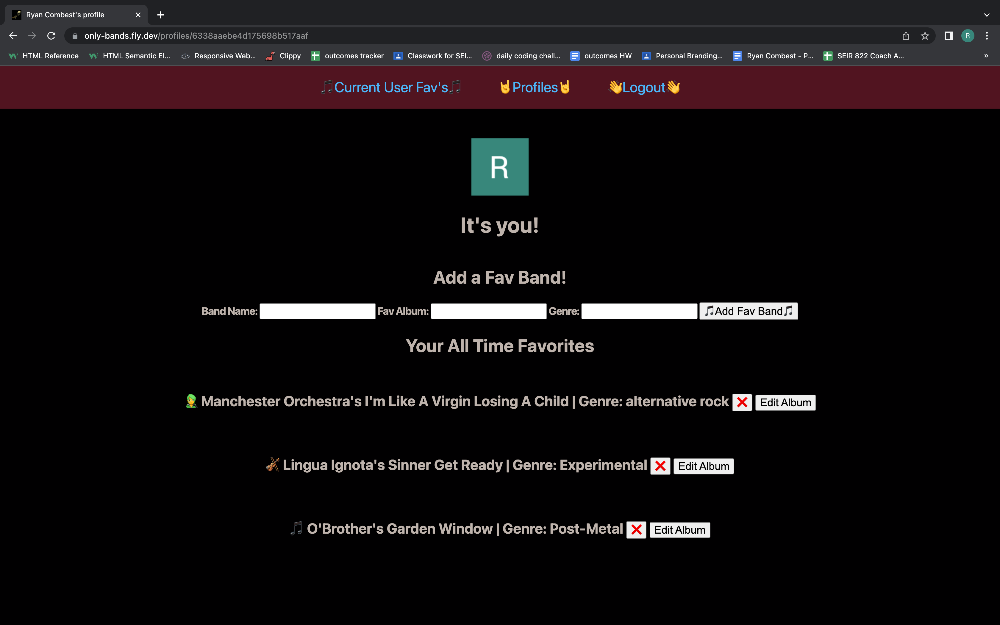
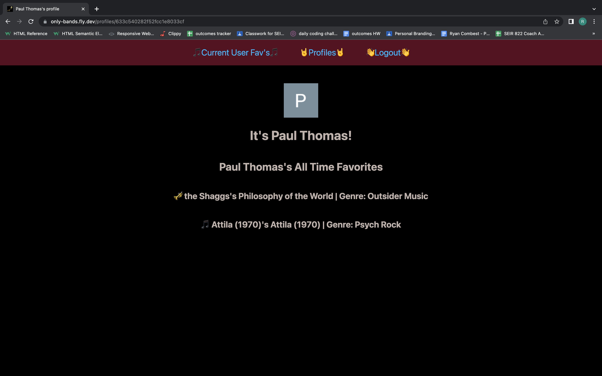

# Only-Bands: It's Not Only Bands (Songs and Albums Too)!

Only-Bands is an app for more than just bands! It allows users to share their favorite songs and artists with one another whether it's a new song they've been listening to on repeat lately, or a long time favorite, close to their heart. Broaden your musical horizons while also showing off your own unique taste!

## Features

- Guests are able to sign in via Google OAuth in order to utilize all the apps features. The only features available to guests without signing-in are the Current User Fav's page and the Song Details page.
 
- Once signed-in, users are able to input new songs to the Current User Fav's page, as well as edit that song by using the Edit button on the Song Details page in the event that a new favorite jam from the same artist takes the place in their heart that the old song once held. 

- From the Song Details page, users are also able to delete song/artist combinations they added to the Current User Fav's page.

- Once signed-in, users are able to navigate to the Profiles page, and click on their own profile to make a list of favorite bands, as well as naming an album by the band, and the genre of music.

- Similar to the Current User Fav's page, users are able to edit the albums in their lists if a different album by the same band starts to edge out the former favorite. 
 
- Users are also able to delete favorites that fall out of favor. 
 
- Finally, users are able to click into other users profiles and see a given users list of favorite bands and albums. 

## Technologies

- Azure 
- CSS
- EJS
- Express
- Google OAuth
- HTML
- JavaScript
- MongoDB
- Mongoose
- Node

## Icebox Items

- [ ] Reactions on songs added to the Current User Fav's page
- [ ] Comment functionality for the Current User Fav's page
- [ ] A new page for users to enter a brief description of the albums from their personal favorites list

## Links

[Launch](https://only-bands.fly.dev/)

[Planning Materials](https://trello.com/b/mCcN2jSN/onlybands)

## Shout-Outs

I want to thank David, Ian, Hunter, Joe and Beryl for all their assistance during this project whether it had to do with routes, functions, favicons, or just taking time to speak with me when I was burnt out and struggling.

I want to thank Emily and Cory for taking time out of their days to help test and troubleshoot with all of us through slack, and Ben for being present and offering encouragement despite being on vacation!

Finally, I want to thank Emily, Jackson, and Beryl for their help in TA hours!

## Screenshots

